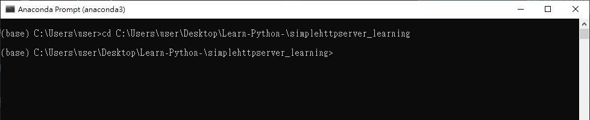

# Coding起來 - Python - 一行指令就能輕鬆建立網頁伺服器 - SimpleHTTPServer套件 - http.server使用教學


嗨嗨，大家有時候在寫網頁前端或簡單的互動視覺化圖時，可能都會想用網頁伺服器來預覽成品放到網頁上的感覺，但有時候只是想簡單檢視一下結果，卻要花上很多時間安裝完整的伺服器(ex.Apache)，或是撰寫nodejs來開啟Local Server，今天就來跟大家介紹一個我今天無意間看到的一個超實用套件- SimpleHTTPServer，它幫助我們省下非常多的時間，只要一行指令輕鬆就能幫助我們開啟Local Server，建立臨時的網頁


## 為什麼要使用SimpleHTTPServer?

+ 它幫助我們快速地將Local端任何目錄底下的資料以網頁的形式分享到網路上，除了可以幫助我們預覽一些工作成果，像是網頁前端、互動視覺畫圖等等，也可以幫助將資料分享於區域網路(Local Network)之中，我們就能快速地展示結果給身邊的人用自己的網路設備觀看

  

+ 使用SimpleHTTPServer的方法，只要擁有Python環境，並只要一行指令就能建立簡單地網頁伺服器


## 環境建置


1. 安裝Python3，並添加到環境變數之中，就能使用命令提示字元(cmd)來執行操作

2.  直接安裝Anaconda，就能直接使用Anaconda Prompt來執行操作


**提醒: 我這邊使用的SimpleHTTPServer套件是Python3版本的喔，所以指令會與Python2不同** 

```
Python3指令: python -m http.server
Python2指令: python -m SimpleHTTPServer
```


## 如何使用SimpleHTTPServer?


#### Step1:

選定欲開方的目錄資料夾，並開啟命令提示字元(cmd)或任何可以使用Python的指令工具(ex. Anaconda Prompt)，我這邊使用Anaconda Prompt 來示範，開啟後切換(cd)到欲開放的目錄資料夾內(ex. cd C:\Users\user\Desktop\Learn-Python-\simplehttpserver_learning)


#### Step2:

開啟Local Server， 在Anaconda Prompt中接著下python -m http.server指令

```
python -m http.server
```


#### Step3:

打開瀏覽器，並輸入

1. 自己觀看的網址: http://127.0.0.1:8000/

2. 分享給別的網址: 
   + 找到自己的IP位置，並在後面加上:8000，就可以囉

ex. http://192.168.31.214:8000/


**補充: 如何找自己的IP位置? 在cmd中，輸入ipconfig指令，就會看到了**


**這樣就算完成囉，是不是非常輕鬆呀，這樣大家就能看到你分享的檔案囉!!**


## 補充: 如果想修改Port呢?

SimpleHTTPServer模組預設的port為8000，也就是上面我們IP位置後面指定的Port，像是http://127.0.0.1:8000/，後面的8000就是Port，如果想要指定不同的Port，非常簡單喔，只要在指令後面加上指定的Port就好，想是我想要將Port改變為8080，就輸入以下指令

```
python -m http.server 8080
```


## 補充: 自行寫一個Python程式來開啟

預設情況下，這個套件會傾聽所有的網路位置，如果想要只傾聽local端的位址，就要自行寫一個Python程式來執行囉


**範例1 : 這是我在網路上找尋大家的文章，所使用的範例程式**

```Python
## http.server.py


# -*- coding: utf-8 -*-
import sys
import http.server
from http.server import SimpleHTTPRequestHandler

HandlerClass = SimpleHTTPRequestHandler
ServerClass  = http.server.HTTPServer
Protocol     = "HTTP/1.0"

if sys.argv[1:]:
    port = int(sys.argv[1])
else:
    port = 8000
server_address = ('127.0.0.1', port)

HandlerClass.protocol_version = Protocol
httpd = ServerClass(server_address, HandlerClass)

sa = httpd.socket.getsockname()
print("Serving HTTP on", sa[0], "port", sa[1], "...")
httpd.serve_forever()

```


**範例2: 這邊檢安教大家如何修改預設的port，只要將程式檔裡的port改變(ex. port = 8060)，再執行這個程式檔，就可以囉!!**

```Python
## http.server.py


# -*- coding: utf-8 -*-
import sys
import http.server
from http.server import SimpleHTTPRequestHandler

HandlerClass = SimpleHTTPRequestHandler
ServerClass  = http.server.HTTPServer
Protocol     = "HTTP/1.0"

if sys.argv[1:]:
    port = int(sys.argv[1])
else:
    port = 8060
server_address = ('127.0.0.1', port)

HandlerClass.protocol_version = Protocol
httpd = ServerClass(server_address, HandlerClass)

sa = httpd.socket.getsockname()
print("Serving HTTP on", sa[0], "port", sa[1], "...")
httpd.serve_forever()

```


接著執行Python檔，開啟Local Server，一樣輸入指令:

```
python -m httpserver
```


結果就會發現，預設的Port改變成8060囉


**希望這次也有幫助到大家~~**


## Reference:


https://blog.gtwang.org/web-development/python-simplehttpserver-web-server/

https://www.afternerd.com/blog/python-http-server/

https://shengyu7697.github.io/blog/2019/11/27/Python-simple-web-server/

https://www.linuxjournal.com/content/tech-tip-really-simple-http-server-python

https://www.itread01.com/content/1547851700.html