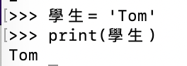
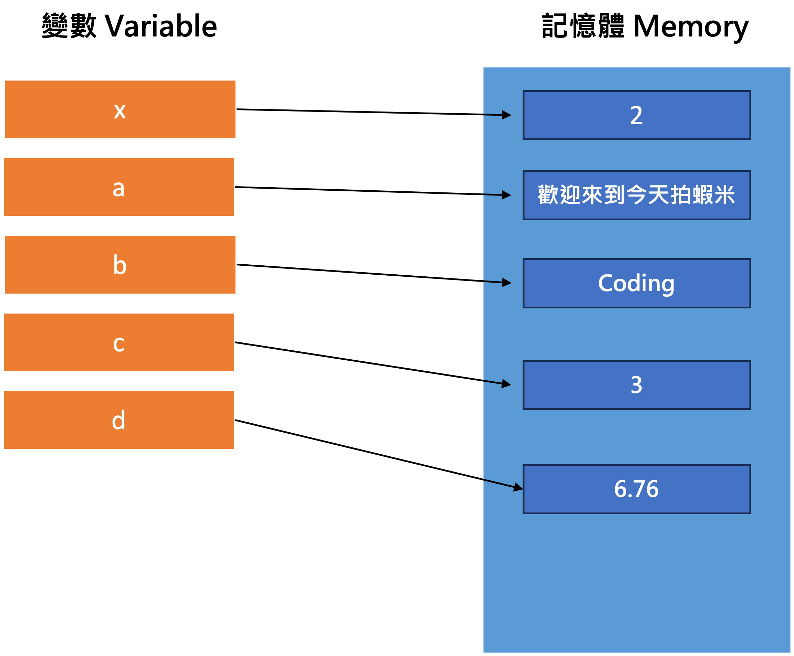

# Python基礎學起來 - 第二集  - 變數的觀念與資料型態

當我們在分享一個故事或一個事情時，為了不想每次都講全名，因為講起來很繞口也很累，所以我們會用某A、B同學、同事C或是朋友D來替代對方的名稱，這個時候其實這個替代的名稱就像是變數，而因為我們替代的是字符串，所以資料型態就會是字符串型態，而當我們的變數是像身高、體重等，就會是數值型態的變數，那就讓我們開始今天的內容吧!

## 目錄

1. 變數是什麼?
2. 變數命名規則
3. 宣告變數 & 記憶體的觀念
4. 資料型態

## 一. 變數是什麼?

網路上有非常多大神分享變數的定義，那我將這些定義整理如下面，並加入自己的一些話

- **內容會改變的數**
    
    舉例來說這次我故事中用到的A先生與我下一次我故事中的A先生可能換人了，所以它的內容被我改變了，就稱為變數，像是在數學上我們也很常用x, y, z來替代一些數值，然後老師可能要我們在了解x的情況下算出y跟z
    
- **可以自行命名且用來儲存資料的一個名稱**

我們可以想像是一個盒子，盒子的名稱由我們自己命名，且裡面的東西也是由我們決定，我們可以在裡面放一段話，放一個名字或是放一些數字等

- **方便我們在寫程式中去使用存在記憶體中的值而自行命名改用的名稱**

這邊像是開頭我們提到的，當我們在寫程式的時候或是說故事的時候，會一直重覆用到一些詞或數字，像是名字，所以我們為了快速且方便，我們會將名字自行改成比較好讀或寫的名稱，像是我把王大明改成A先生等

## 二. 變數命名規則

### **符合規定的命名包含**

- 大寫字符: A ~ Z
- 小寫字符: a ~ z
- 數字: 0 ~ 9
- 底線: _

> **More: Python還可以用中文字當變數，但因為我們使用變數就是要快，所以比較不常見到用中文當變數**
> 



### **不能用的命名方式**

- 數字開頭
    
    ex. 123a, 967ba8
    
- Python 保留字
    
    由於下面這些都是Python在執行上會用到的一些方式，所以不適合當成變數名稱使用
    
    ex. 
    
    | and | as | assert | async | await |
    | --- | --- | --- | --- | --- |
    | break | def | del | return | try |
    | lambda | or | yield | else | finally |

> 除了上面這些Python還有其它保留字，但因為通常命名也不太會想到這些當變數名稱，所以大家也不用太擔心，真的遇到了就改個名稱就好
> 

> 沒有列到的像是空白鍵、星星符號等，再命名上都會造成程式報錯，所以也不要使用喔
> 

### 什麼是好的變數名稱

其實只要清楚明瞭，讓我們一看到這個變數名稱就知道代表的意義，就是一個好的變數名稱，這邊我從Geo-Python的文章中提取了它對於好的變數名稱定義

1. 清晰簡潔
2. 用英文命名。一般編碼慣例是使用英文來命名變數，因為這是程式設計師之間最常見的共同語言。因此，應避免使用像muuttuja這樣的變數名稱。
3. 變數名稱不要包含特殊字符。Python支持透過程式中給出的各種編碼選項使用特殊字符。但是，在某些情況下，使用類似於lämpötila的變數名稱可能會引起編碼問題。為了安全起見，最好遵循標準的可打印ASCII字符集。
4. 不要與任何Python關鍵字( Python 保留字)衝突，如for、True、False、and、if、or、else。這些關鍵字在Python中用於特殊操作，不能當成是變數名稱。

資料來源: [https://geo-python.github.io/site/notebooks/L1/gcp-1-variable-naming.html](https://geo-python.github.io/site/notebooks/L1/gcp-1-variable-naming.html)

## 三. 宣告變數 & 記憶體觀念

### 宣告變數

簡單來說其實就是賦值給這個我們命名的變數名稱，會用 = 號來表示

ex. 


過去我們學的數學可能會讓大家以為是x等於2，但在程式中我們應該解釋為我們把2這個數值指派給了x這個我們命名的變數

當然我們也可以給變數一段話，一個字，一個字母，一個數值或一個浮點數等


### 記憶體的觀念

當我們宣告好變數後，這個變數會被存在電腦的記憶體中，這樣我們後續再調用這個變數的時候，電腦就會幫我們去記憶體中拿取剛剛存進的變數值

> Python在宣告變數的過程中，並不需要像很多其他語言需要事先定義好資料型態，而是它會**動態的去根據我們宣告給變數的值來調整資料型態**，是不是非常方便啊! 但這樣也等於犧牲掉了一些效能
> 

**舉例來說:**

我們為了方便自己找尋相關資料網頁，會把它們存在我的最愛中(記憶體)，為了方便往後快速找到它，可能還會幫它命名一個好記的名稱(宣告變數)，之後當我們需要這筆資料的時候，再到我的最愛中找尋對應的名稱，點進後即可取得我們要的資料網頁

以前面我們設定好的變數來看的話，會像如圖這樣



## 四. 資料型態

學完怎麼宣告變數後，接下來我們就要來了解我們傳遞給變數的資料型態可以有哪些了

Python大致上賦予我們的變數四種不同的資料型態: 數值、字符串、布林值、特殊的容器(ex. List、Array, Tuple)

### 1. **數值**

a. **整數: int(Integers)**

ex. 0,1,2,3,4,5,6…等

```python
x = 1
y = 26
z = 999
print(x)
print(y)
print(z)
# 類型檢測
print(type(x), type(y), type(z))
```

**執行結果**

```
1
26
999
<class 'int'> <class 'int'> <class 'int'>
```

b. **浮點數**

ex. 1.3, 2.6, 7.92等

```python
a = 2.7
b = 9.78
c = 10.967
print(a)
print(b)
print(c)
# 類型檢測
print(type(a), type(b), type(c))
```

執行結果

```
2.7
9.78
10.967
<class 'float'> <class 'float'> <class 'float'>
```

### 2. **字符串**

**a. 單行文字: str(String)**

可以使用**單引號**或**雙引號**: ‘’或””

p.s. 我記得沒錯的話，有些程式語言單引號只能用在當只有一個字母的時候

```python
# 單行文字

# 單引號
Name = 'Ken'
# 雙引號
Note = 'Welcome To My Website'

print(Name)
print(Note)
print("Hello " + Name + ", " + Note)
print(type(Name), type(Note))
```

執行結果

```
Ken
Welcome To My Website
Hello Ken, Welcome To My Website
<class 'str'> <class 'str'>
```

b**. 多行文字:** 

可以使用**三個雙引號: “”” “””**

```python
# 多行文字

Email = """
Dear Wang,
Your Product have arrived.

Best Regards,
Su
"""

print(Email)
print(type(Email))
```

**執行結果**

```
Dear Wang,
Your Product have arrived.

Best Regards,
Su

<class 'str'>
```

### 3. **布林值 Boolean**

```python
## Boolean

is_checked = True

Flag = False

print(is_checked)
print(Flag)
print(type(is_checked), type(Flag))

if is_checked == True:
    print("Done")
```

**執行結果**

```
True
False
<class 'bool'> <class 'bool'>
Done
```

1. **容器**

可以存放像是List、Array、Tuple等

```python
import numpy as np

# List
score_list = [61, 86, 96.3, 99.8]
name_list = ['Una', 'Tom', 'Ken']

# Array
info = np.array([ [1, 3, 5], [2, 4, 6] ])

# Tuple
e_tuple = (1,2,3)

print("Score: ", score_list)
print("Name: ", name_list)
print(info)
print(e_tuple)
print(type(score_list), type(name_list), type(info), type(e_tuple))
```

**執行結果**

```
Score:  [61, 86, 96.3, 99.8]
Name:  ['Una', 'Tom', 'Ken']
[[1 3 5]
 [2 4 6]]
(1, 2, 3)
<class 'list'> <class 'list'> <class 'numpy.ndarray'> <class 'tuple'>
```

今天我們把腳正式踏入了這個領域，太有趣了，命名也是一個很大的學問，能夠一目瞭然知道這個變數是做什麼用的，是一件非常不容易的事，下一篇就讓我們來了解怎麼開始建立條件了! 期待下篇大家的閱讀了，感謝!

## Reference

[https://chunyeung.medium.com/給自學者的python教學-4-變數篇ep1-9ac8164aac75](https://chunyeung.medium.com/%E7%B5%A6%E8%87%AA%E5%AD%B8%E8%80%85%E7%9A%84python%E6%95%99%E5%AD%B8-4-%E8%AE%8A%E6%95%B8%E7%AF%87ep1-9ac8164aac75)

[https://realpython.com/python-variables/](https://realpython.com/python-variables/)

[https://www.learncodewithmike.com/2019/11/python3-python.html](https://www.learncodewithmike.com/2019/11/python3-python.html)

[https://steam.oxxostudio.tw/category/python/basic/variable.html](https://steam.oxxostudio.tw/category/python/basic/variable.html)

[https://tw511.com/a/01/3236.html](https://tw511.com/a/01/3236.html)